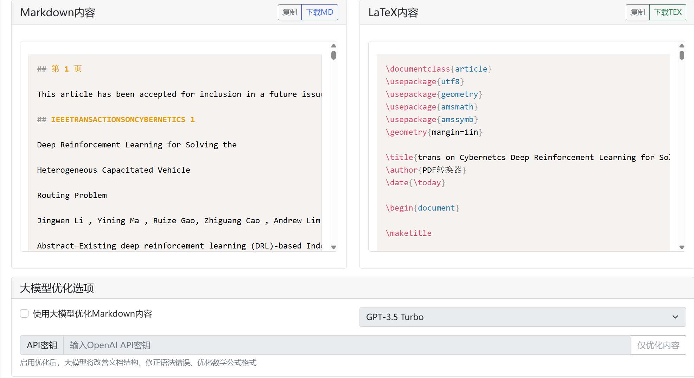

# PDF 转 Markdown 转 LaTeX 服务

一个基于 Flask 的 Web 服务，可将 PDF 文件转换为结构化的 Markdown 文档，并进一步转换为 LaTeX 文件。支持使用大语言模型（LLM）对内容进行优化。


## 功能特性

*   **PDF 文本提取**：使用 `PyPDF2` 和 `pdfplumber` 两种引擎提取 PDF 文本，提高兼容性。
*   **智能格式化**：将提取的文本自动格式化为带有标题层级的 Markdown。
*   **Markdown 转 LaTeX**：使用 `pypandoc` 将 Markdown 转换为专业的 LaTeX 文档。
*   **大模型优化**：可选地通过 OpenAI API（如 GPT-3.5）优化 Markdown 内容，修正语法、优化结构和数学公式。
*   **实时日志**：提供详细的转换过程日志，便于监控和调试。
*   **Web 界面**：提供直观的网页界面进行文件上传和结果查看。

## 安装指南

1.  **克隆仓库**
    ```bash
    git clone https://github.com/your-username/pdf-to-latex-converter.git
    cd pdf-to-latex-converter
    ```

2.  **创建虚拟环境（推荐）**
    ```bash
    python -m venv venv
    source venv/bin/activate  # Linux/MacOS
    # 或 venv\Scripts\activate  # Windows
    ```

3.  **安装依赖**
    ```bash
    pip install -r requirements.txt
    ```

    **requirements.txt** 文件内容：
    ```txt
    Flask>=2.0.0
    PyPDF2>=3.0.0
    pdfplumber>=0.9.0
    pypandoc>=1.11
    openai>=1.0.0  # 仅当需要LLM优化时
    ```

4.  **安装 Pandoc**
    `pypandoc` 需要系统级别的 `pandoc` 工具。
    *   **Ubuntu/Debian**: `sudo apt-get install pandoc`
    *   **macOS**: `brew install pandoc`
    *   **Windows**: 从 [Pandoc 官网](https://pandoc.org/installing.html) 下载安装程序。

## 使用方法

1.  **启动服务**
    ```bash
    python app.py
    ```
    服务将在 `http://localhost:5000` 启动。

2.  **访问 Web 界面**
    在浏览器中打开 `http://localhost:5000`。

3.  **上传 PDF**
    *   点击 "选择文件" 按钮，选择一个 PDF 文件。
    *   （可选）勾选 "使用大模型优化" 并输入你的 OpenAI API 密钥（如 `sk-...`）。
    *   点击 "转换" 按钮。

4.  **查看结果**
    *   系统会显示转换过程的实时日志。
    *   转换成功后，你可以在页面上查看生成的 Markdown 和 LaTeX 内容。
    *   点击 "下载 LaTeX 文件" 按钮，将 `.tex` 文件保存到本地。

## API 接口

本服务也提供 RESTful API。

*   **`POST /upload_pdf`**: 上传 PDF 文件，返回 Markdown 内容。
*   **`POST /convert_to_latex`**: 将 Markdown 内容转换为 LaTeX。
*   **`POST /download_latex`**: 下载 LaTeX 文件。
*   **`GET /get_latest_logs`**: 获取最新的转换日志。

## 图片处理

**重要提示**：此版本的转换器**主要专注于文本内容**。它不会自动提取和嵌入 PDF 中的图片。

## 配置

*   **文件大小限制**：默认最大为 16MB，可在 `app.py` 中修改 `app.config['MAX_CONTENT_LENGTH']`。
*   **日志文件**：转换日志将记录在 `conversion.log` 文件中。

## 依赖库

*   `Flask`: Web 框架
*   `PyPDF2`: PDF 读取库
*   `pdfplumber`: 提供更精确的文本和表格提取
*   `pypandoc`: 连接 Python 和 Pandoc，用于格式转换
*   `openai`: 用于与 OpenAI API 交互（可选）

## 许可证

[MIT License](LICENSE)

[](https://star-history.com/#CaoYongshengcys/pdf2md2latex&Date)
